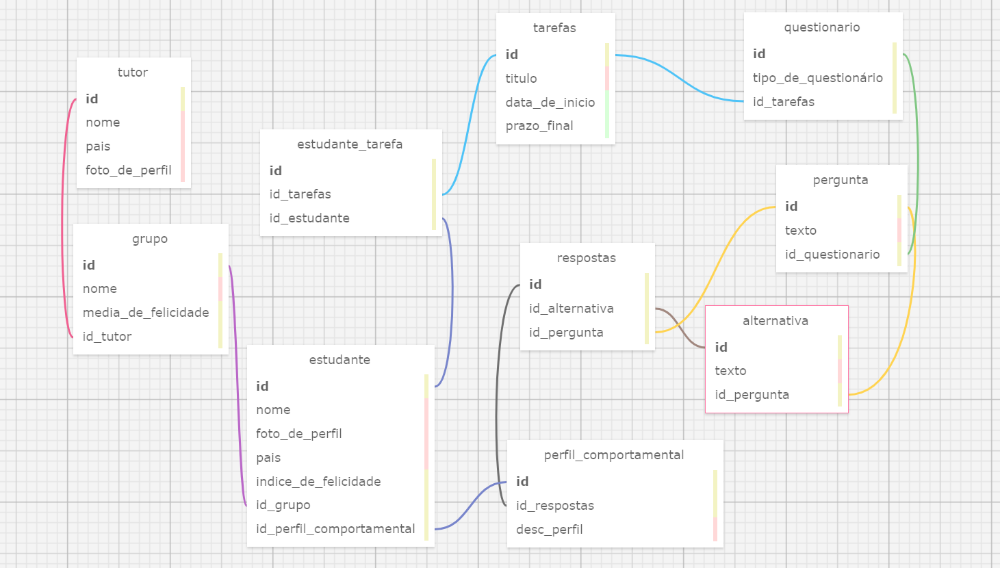
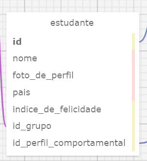
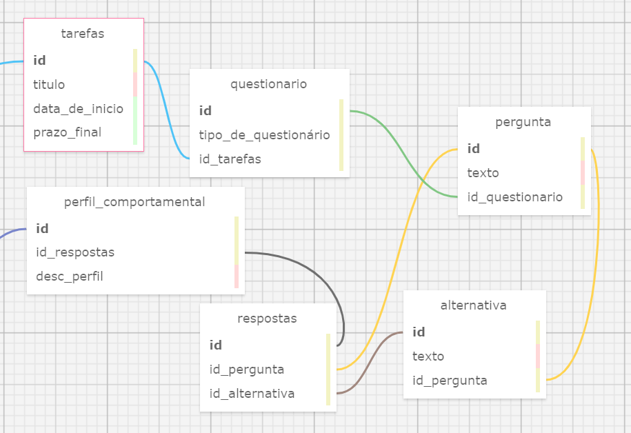
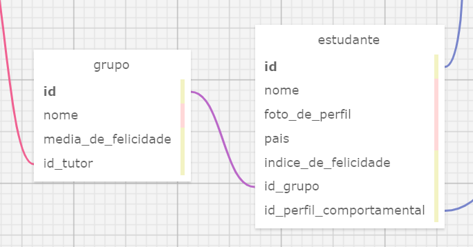
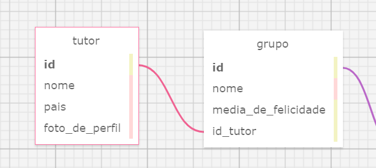
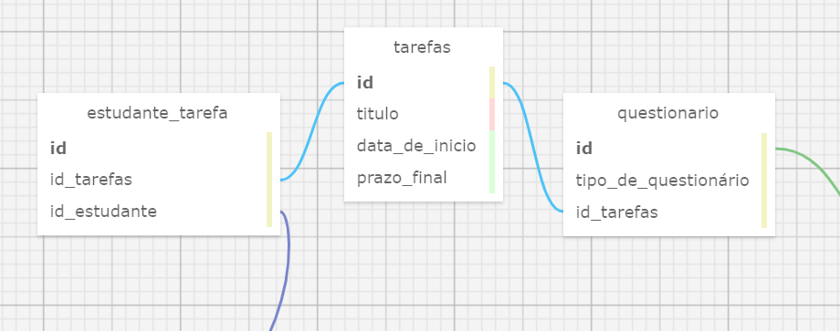
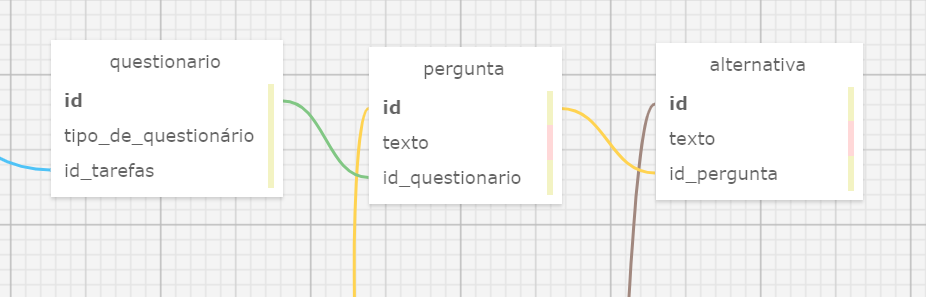
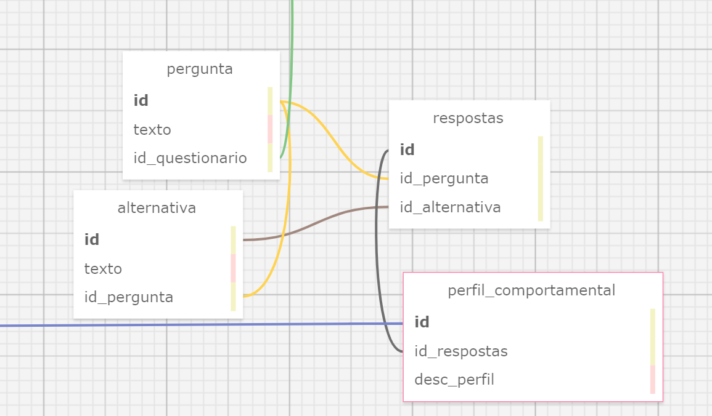

# Modelagem de Banco de Dados

## Explicação do Modelo de Banco de Dados e como decorreu a sua criação

Partindo do passo a passo para estabelecer a estrutura do banco de dados para o sistema que será desempenhado durante essa módulo, foram seguidas 3 etapas:

**1. Identificar as entidades principais do sistema e os seus atributos.**

Dentro do contexto do website que será desenvolvido para a Zuyd, pode-se estabelecer como entidades principais os estudantes, os tutores e os grupos. Cada uma dessas entidades possuem informações próprias que são os atributos e constituem uma tabela. Na tabela Estudantes, por exemplo, os atributos serão: nome, foto de perfil, pais, índice de felicidade e perfil de liderança. Seguindo esse mesmo raciocínio definiu-se as informações relacionadas ao grupo e ao tutor.

**Tabela da Entidade Estudante**

Além dessas entidades, mais facilmente compreendidas, tem se também as tabelas direcionadas ao funcionamento dos formulários que rege a funcionalidade principal do website. Para isso, foram criadas tabelas para as tarefas, questionário, pergunta, alternativa, respostas e perfil comportamental, priorizando a versatilidade dessas tabelas.

Com essa separação, há a garantia de que questionários com quantidade de perguntas diferentes podem ser integrados com mais facilidade, bem como, perguntas com quantidade de alternativas variáveis, também podem estar na estrutura sem problemas. Isso porque as alternativas não estão de forma fixa na tabela das perguntas, mas constituem uma nova tabela que se relaciona com a pergunta por meio das chaves. Além disso, a devolução de resultados em forma de "perfil comportamental" torna-se possível.

**2. Identificar os relacionamentos entre as entidades e a sua cardinalidade.**

Sabendo-se quem são as entidades principais, pode-se começar a pensar mais diretamente em como elas se relacionam de forma lógica no projeto. 

**Grupo e Estudante**

Dentro da estrutura da aplicação, estabeleceu-se que cada grupo terá 5 integrantes, sendo portanto, um grupo para muitos integrantes. Desse modo, infere-se por meio do conceito de cardinalidade, que esse caso é de 1:N, pois cada grupo está relacionado a muitos integrantes, mas cada integrante está relacionado a apenas um grupo. Para isso, tem-se a chave estrangeira estabelecida pela coluna "id_grupo" na tabela "estudante", que faz referência ao "id" na tabela "grupo", relacionando essas duas tabelas.

**Tutor e Grupo**

Da mesma forma, cada grupo terá apenas um tutor, mas um tutor poderá ter muitos grupos. Por isso, a cardinalidade desse relacionamento também é de 1:N e a chave que proporciona isso é o id do tutor como chave estrangeira na tabela do grupo.

**Estudante e Tarefa**

Para o funcionamento de acesso aos formulários, foi pensado em sistema de tarefas a serem cumpridas no site. Com isso, pode-se entender que um estudante poderá ter mais de uma tarefa, assim como, uma tarefa pode estar associada a mais de um estudante. Sendo assim, a cardinalidade nesse caso é de N:N e a relação se dá por meio de uma tabela intermediária "estudante_tarefa", necessária nesses casos, que relaciona a tarefa e o estudante por meio da chave primária de cada uma das tabelas.

**Tarefa e Questionário**

Cada tarefa estará associada a um questionário, apresentando uma cardinalidade de 1:1, por isso, a tabela de tarefa será referenciada através da sua chave primária no questionário correspondente para que ambos estejam devidamente relacionados.

**Questionário e Pergunta**

Na aplicação, existem diferentes tipos de questionários, por isso, para trazer mais flexibilidade para a organização das perguntas, essas duas tabelas foram separadas. De modo que a pergunta seja acessada através do id do questionário que ela pertence, para isso, foi adicionada na coluna da tabela de pergunta, uma chave estrangeira de id do questionário. Vale resssaltar que nesse caso a cardinalidade é de 1:N, isso poque um questionário tem várias perguntas, mas uma pergunta tem apenas um questionário.

**Pergunta e Alternalita**

Assim também, como uma pergunta tem várias alternativas e cada alternativa pertence a apenas uma pergunta, a cardinalidade se torna 1:N. Mais uma vez, a conexão se torna possível pela chave estrangeira "id_pergunta" na tabela de alternativa.

**Resposta e Perfil Comportamental**

A tabela da resposta armazenará tanto a pergunta, como também a alternativa que foi escolhida pelo usuário. Para isso, ela se relacionará com as duas tabelas através de chaves estrangeiras: id_alternativa e id_pergunta. Bem como, essa tabela será referenciada por meio da sua chave primária na tabela de perfil comportamental. É importante explicar que, por meio das resposta do questionário, será gerado um resultado, que será o perfil comportamental. Esse perfil comportamental por sua vez, se relacionará com a tabela estudante por meio do id_perfil_comportamental.

**3. Realizar o esboço do modelo conceitual.**

Por fim, depois de estabelecer os pontos anteriores, foi finalizada a criação do modelo conceitual a partir da plataforma https://sql.toad.cz/, com as devidas tabelas relacionadas com suas chaves primárias e estrangeiras.
Na mesma plataforma, tornou-se possível gerar um arquivo .xml do que foi desenvolvido, com os tipos de dados já definidos. A partir desse arquivo, utilizando o chatgpt houve a transformação do arquivo .xml em .sql.
Além disso, para que houvesse a possibilidade de visualizar e manipular o modelo que foi criado, adicionou-se os códigos do arquivo .sql no DBeaver. Obtendo o seguinte diagrama:

**Diagrama DBeaver**

