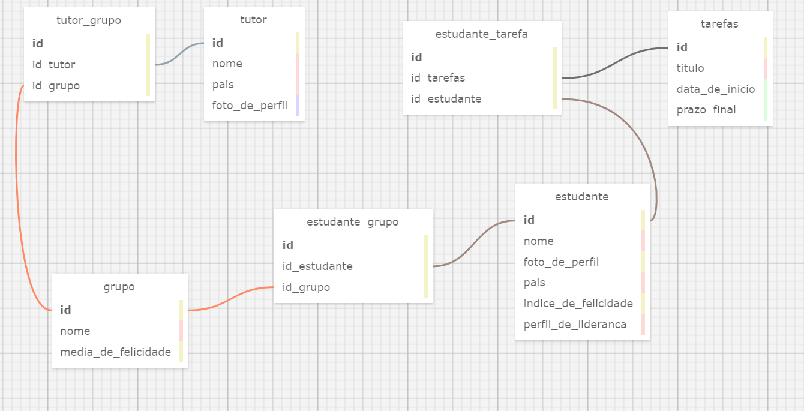
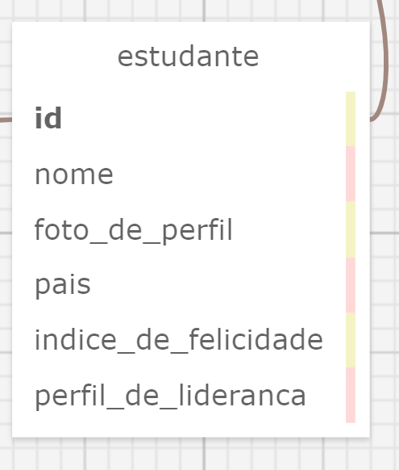
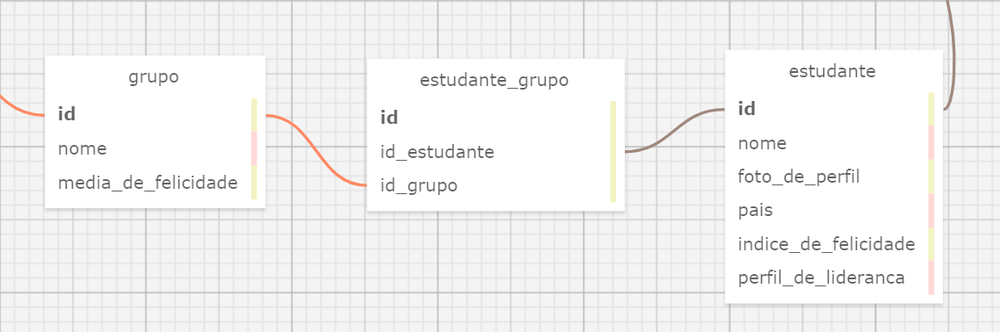
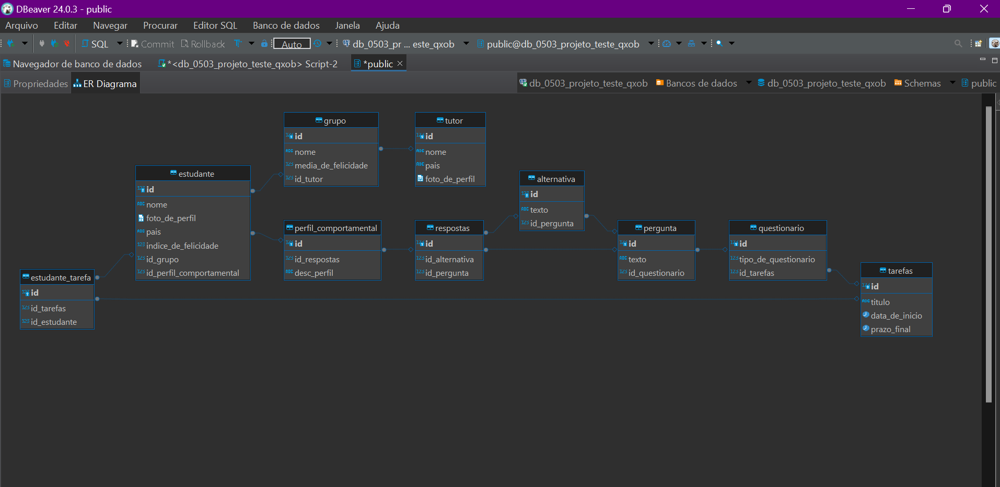

# Modelagem de Banco de Dados

## Explicação do Modelo de Banco de Dados e como decorreu a sua criação

Partindo do passo a passo para estabelecer a estrutura do banco de dados para o sistema que será desempenhado durante essa módulo, foram seguidas 3 etapas:

**1. Identificar as entidades principais do sistema e os seus atributos.**

Dentro do contexto do website que será desenvolvido para a Zuyd, pode-se estabelecer como entidades principais os estudantes, os tutores e os grupos. Cada uma dessas entidades possuem informações próprias que são os atributos e constituem uma tabela. Na tabela Estudantes, por exemplo, os atributos serão: nome, foto de perfil, pais, índice de felicidade e perfil de liderança. Seguindo esse mesmo raciocínio definiu-se as informações relacionadas ao grupo e ao tutor.

**Tabela da Entidade Estudante**

**2. Identificar os relacionamentos entre as entidades e a sua cardinalidade.**

Sabendo-se quem são as entidades principais, pode-se começar a pensar em como elas se relacionam de forma lógica no projeto. Dentro da estrutura da aplicação, estabeleceu-se que cada grupo terá 4 integrantes, por isso, torna-se importante a criação de tabelas intermediárias que farão o relacionamento entre estudante e grupo pela chave primária de cada tabela. Deve-se inferir também, por meio do conceito de cardinalidade, que um grupo terá mais de um estudante (1,n), enquanto cada estudante estará associado a apenas um grupo (1,1).
Nesse mesmo sentido, para relacionar tutor e grupo, foi criada a tabela "tutor_grupo", em que cada grupo terá um tutor (1,1) e um tutor poderá trabalhar com vários grupos(1,n).

**Tabela intermediária**

**3. Realizar o esboço do modelo conceitual.**

Por fim, depois de estabelecer os pontos anteriores, foi finalizada a criação do modelo conceitual a partir da plataforma https://sql.toad.cz/, com as devidas tabelas relacionadas com suas chaves primárias e estrangeiras.
Na mesma plataforma, tornou-se possível gerar um arquivo .xml do que foi desenvolvido, com os tipos de dados já definidos. A partir desse arquivo, utilizando o chatgpt houve a transformação do arquivo .xml em .sql.
Além disso, para que houvesse a possibilidade de visualizar e manipular o modelo que foi criado, adicionou-se os códigos do arquivo .sql no DBeaver. Obtendo o seguinte diagrama:

**Diagrama DBeaver**

